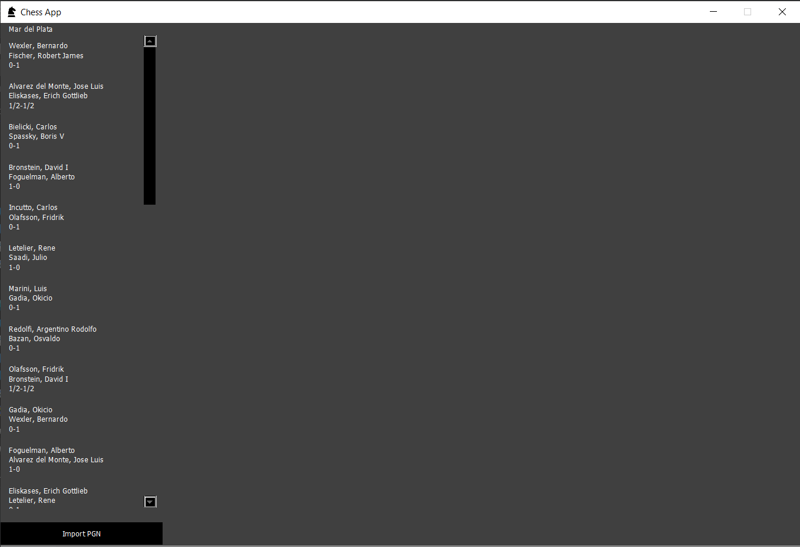

# Chess App

This is program written in java that helps you analyze and go through games in PGN notation format.

## GUI

There's a gui interface available
> Note: not all functionalities are included



## Usage

Most classes are self-explanatory and there are tests available for a decent amount of them.

## Read PGN File
```java
ArrayList<Game> games = PGNReader.readPGNFile("path-to-file.pgn");
```
## Movement
```java
// Vanilla
Move move = new Move(from, to, moving);
// Capturing
Move move = new Move(from, to, moving, captured);
// Promoting
Move move = new Move(from, to, moving, captured, promotion);
```
## Board
```java
// Decleration
Board board = new Board(doneMoves);
```
### Applying movement to boards
```java
// Manual
board.doMove(Move move);

// By Notation
board.doMove(String notation, boolean isWhite);
```
```java
board.toString();
```
```
0 A B C D E F G H
1 R N B Q K B N R
2 P P P P P P P P
3                
4                
5                
6                
7 p p p p p p p p
8 r n b q k b n r
```


## Contributing
Pull requests are welcome. For major changes, please open an issue first to discuss what you would like to change.

Please make sure to update tests as appropriate.

## License
[MIT](LICENSE.md)